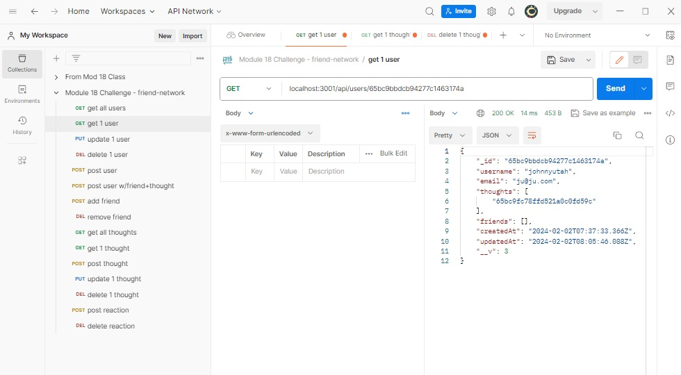

# Friend-Network

## Author
Tony Magrady - Berkeley Full-Stack Web Development Bootcamp student, Fall-Winter Session 2023-2024

## Badges

## Table of Contents

- [Description](#description)
- [Installation](#installation)
- [Usage](#usage)
- [Credits](#credits)
- [License](#license)

## Description

This is the back end /API for a Friend Network social website. It is a NoSQL Express application using MongoDB / Mongoose. With this application, users can share their thoughts, react to others' thoughts, and add to their friend list. Postman app was used to test and demostrate API calls. Linked below is a demonstration of use of the API.  

## Installation

Installed apps include Node.js (Javascript runtime), Express (web app framework), MongoDB (NoSQL^^ database), Mongoose (Object Data Madel, ODM), and Dotenv (manages private environment variables for use in code).  
An additional JavaScript date library was not used to format timestamps. Native .toLocaleString method is used for this.  
^^  MongoDB is a database with a non-relational document model. It is a "NoSQL" database in comparison to traditional relational databases.

## Usage

To run locally:
- Access the repo root folder (/friend-network).
- Start server and enable database synchronization (npm run dev).
- Delete all database data (npm run clearCollections).  (There is no seed script.)
- Message is displayed "App listening on port 3001!", as server runs and waits.
- Client accessed by (localhost:3001/api/...) to access and update User and Thought data.  Examples:
    - localhost:3001/api/thoughts  
    - localhost:3001/api/users/:id/friends/:friendId

[Demo Link - Part 1](https://app.screencastify.com/v3/watch/3AxbI9mfWfHddiTOMM6f)  
[Demo Link - Part 2](https://app.screencastify.com/v3/watch/nxzdPDkXYQCUkxpoHupR)  

## Credits

Excellent assistance from weekly tutor, boot camp instructor, and TAs.

## License

The MIT License

Copyright (c) (2023) (Tony Magrady)

    Permission is hereby granted, free of charge, to any person obtaining a copy
    of this software and associated documentation files (the "Software"), to deal
    in the Software without restriction, including without limitation the rights
    to use, copy, modify, merge, publish, distribute, sublicense, and/or sell
    copies of the Software, and to permit persons to whom the Software is
    furnished to do so, subject to the following conditions:
    
    The above copyright notice and this permission notice shall be included in all
    copies or substantial portions of the Software.
    
    THE SOFTWARE IS PROVIDED "AS IS", WITHOUT WARRANTY OF ANY KIND, EXPRESS OR
    IMPLIED, INCLUDING BUT NOT LIMITED TO THE WARRANTIES OF MERCHANTABILITY,
    FITNESS FOR A PARTICULAR PURPOSE AND NONINFRINGEMENT. IN NO EVENT SHALL THE
    AUTHORS OR COPYRIGHT HOLDERS BE LIABLE FOR ANY CLAIM, DAMAGES OR OTHER
    LIABILITY, WHETHER IN AN ACTION OF CONTRACT, TORT OR OTHERWISE, ARISING FROM,
    OUT OF OR IN CONNECTION WITH THE SOFTWARE OR THE USE OR OTHER DEALINGS IN THE
    SOFTWARE.